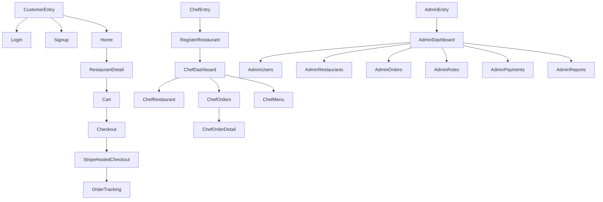

## Scope (based on current routes)
Source of truth: [frontend/src/routes/AppRoutes.jsx](frontend/src/routes/AppRoutes.jsx)

### Customer (public/customer)
- `/home` Restaurants list + city selection modal
- `/restaurant/:id` Restaurant detail + menu list
- `/cart` Cart + order summary
- `/checkout` Delivery details + Stripe
- `/orders/:id` Order tracking

### Auth / onboarding
- `/login`
- `/signup`
- `/register-restaurant` (chef onboarding)
- `/unauthorized`

### Chef (protected: role=chef)
- `/chef-dashboard`
- `/chef/restaurant`
- `/chef/orders`
- `/chef/orders/:id`
- `/chef/menu`

### Admin (protected: role=admin)
- `/admin-dashboard`
- `/users`
- `/restaurants`
- `/orders`
- `/roles`
- `/payments`
- `/reports`

---

## UX review (what’s working / what’s hurting “professional”)

### What’s already good
- **Clear role separation**: `ProtectedRoute` + role home paths ([frontend/src/routes/ProtectedRoute.jsx](frontend/src/routes/ProtectedRoute.jsx), [frontend/src/auth/roles.js](frontend/src/auth/roles.js)).
- **Reusable admin/chef shell**: sidebar + topbar + content layout shared (chef reuses admin shell classes) ([frontend/src/admin/components/AdminLayout.jsx](frontend/src/admin/components/AdminLayout.jsx), [frontend/src/chef/components/ChefLayout.jsx](frontend/src/chef/components/ChefLayout.jsx)).
- **Consistent data loading pattern**: `DataState` wrappers used for admin/chef tables (good foundation).

### Biggest gaps to fix for “top professional + simple”
- **Two different navigation systems** for customer pages:
  - Tailwind `Navbar` exists ([frontend/src/components/Navbar.jsx](frontend/src/components/Navbar.jsx))
  - But customer pages mostly use `AuthedLayout` which is a different topbar and button style ([frontend/src/pages/AuthedLayout.jsx](frontend/src/pages/AuthedLayout.jsx))
  - Result: UI feels inconsistent.
- **Mixed styling approaches** on auth screens: e.g. `LoginPage` uses inline Tailwind classes on inputs while other pages rely on `ui.css` inputs ([frontend/src/pages/LoginPage.jsx](frontend/src/pages/LoginPage.jsx)). This breaks the “single design system” feel.
- **Information architecture**: customer flow is good, but it’s missing “standard” app pages that make products feel complete (profile, order history). We’ll list these as next-step additions without implementing unless you want.

---

## Sitemap diagrams (role-based)

---

## Low‑fi wireframes (Customer)

### `/home` (restaurants + location)
- **Top nav**: Logo, Search, Cart badge, Account
- **Hero**: “Restaurants in {City}” + city selector
- **Filters row**: Search field, Category chips, Sort
- **Sections**: Featured (3 cards), All restaurants grid
- **Location modal** (blocking until chosen): list of cities, search city

Wireframe:
- Header
  - Left: Brand
  - Center: Search
  - Right: Cart(Count), Account
- Body
  - Title + city dropdown
  - Filter bar
  - Featured cards
  - Restaurant grid

### `/restaurant/:id` (restaurant page)
- **Header**: Restaurant name, short description, rating, delivery fee/time
- **Sticky category tabs**: Burgers, Pizza, Drinks…
- **Menu list**: item card (name, desc, price, add button)
- **Mini cart** (right on desktop): items + checkout CTA

### `/cart`
- **Left**: line items (qty stepper, remove)
- **Right**: summary (subtotal, delivery, total) + checkout
- Empty state: CTA back to restaurants

### `/checkout`
- **Left**: delivery details form
- **Right**: order summary + “Pay with Stripe”
- Error handling shown inline

### `/orders/:id`
- **Order header**: order id, restaurant, customer info
- **Status tracker**: 5 steps
- **Items + totals**
- Payment status message

---

## Low‑fi wireframes (Chef)

### `/chef-dashboard`
- KPI cards (total, active, completed, today)
- Recent orders table (order id, customer, items, status, time)
- “View all orders” primary CTA

### `/chef/restaurant`
- Status cards (approved/pending/blocked)
- Profile form (name, city, menu type, description)
- Success message inline

### `/chef/orders`
- Tabs: New / Preparing / Completed
- Table with quick actions per row (accept → preparing → dispatched → completed)
- Refresh button

### `/chef/orders/:id`
- Left: order info + status
- Right: action buttons (enabled/disabled based on status)
- Items table + totals

### `/chef/menu`
- Search
- “Add item”
- Table with availability badge + actions (edit, enable/disable, delete)
- Add/edit drawer/card form

---

## Low‑fi wireframes (Admin)

### `/admin-dashboard`
- KPI grid (users, restaurants, active/pending, orders, revenue)
- Recent orders table

### `/restaurants`
- Summary badges: total, pending
- Table: restaurant, city, status, rating, chef
- Actions: edit / approve / reject / block-unblock
- Create/edit form card

### `/users`
- Search
- Table with actions (view, block/unblock, delete)

### `/orders`
- Status filter
- Table: order, user, restaurant, status, payment, total

### `/roles`
- Create role
- Grant permissions (resource + actions)
- Roles table (permissions badges)

### `/payments`
- Transactions table

### `/reports`
- Placeholder cards for future charts

---

## “Professional” simplification checklist (implementation direction)

### Unify customer layout/navigation
- Make **one** customer shell (choose `Navbar` OR `AuthedLayout`, not both) and apply it to all customer pages.
- Ensure consistent placement for: search, cart badge, profile/logout.

### Standardize components (design system)
- Buttons: `Primary`, `Secondary`, `Danger`
- Inputs: `TextInput`, `Select`, `Textarea`
- Cards: `SurfaceCard`
- Badges: `StatusBadge`

### Content polish (small changes, big impact)
- Consistent naming: “AmricanFood” vs “AmericanDemoFood” appears in multiple places.
- Reduce technical text (“endpoint not available”) in customer-facing areas; keep it only in admin/chef, or show friendly copy.

### Missing screens to feel complete (optional next)
- Customer: Order history, Profile, Saved addresses
- Chef: Payouts, Store hours, Inventory/availability bulk edit
- Admin: Restaurant detail page (audit trail), manual refunds, support inbox
